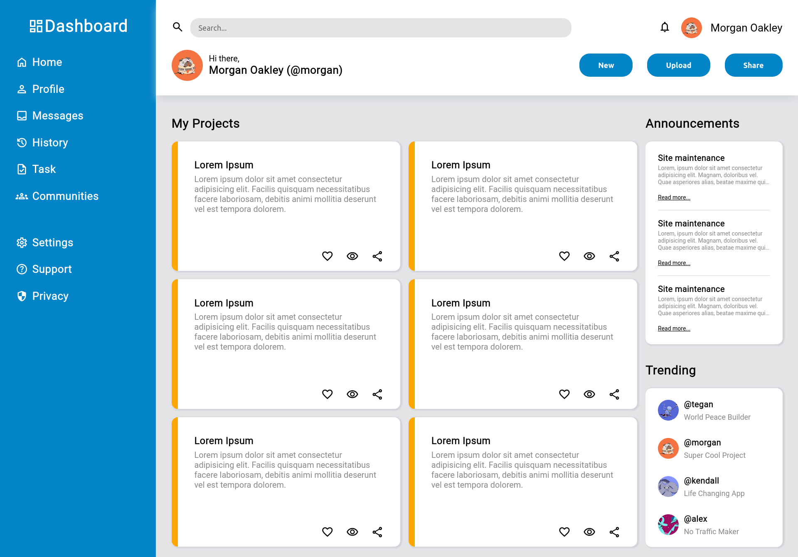

    
    <h1>Admin Dashboard </h1>
    
Simple admin dashboard

    

        <a href="https://jotafer19.github.io/admin-dashboard/" target="_blank" rel="noreferrer noopener">View Demo</a> · 
        <a href="https://github.com/jotafer19/admin-dashboard/issues" target="_blank" rel="noreferrer noopener">Report Bug</a> ·
        <a href="https://github.com/jotafer19/admin-dashboard/issues" target="_blank" rel="noreferrer noopener"> Request Feature</a>
    

## Preview

### Features

- A simple webpage built to test CSS Grid and Flexbox.
- It has simple animations to improve user experience.
- Clean UI for better visuals.

### Built With

-    
-    
- 

### Tools Used

- 
-   
- 

## Outcome

* Used intermediate HTML to take present the information to the user.
* Used CSS **Grid** and **Flexbox** to manage layout.
* Used **Git** and **GitHub** for project management.
* Tried to maintain **clean code**.

## What I learned

* Better knowledge and it's practical usability of **CSS Grid and Flexbox**.
* A lot of minor things.

## Acknowledgments

* Inspiration by [**The Odin Project**](https://www.theodinproject.com/lessons/node-path-intermediate-html-and-css-admin-dashboard).